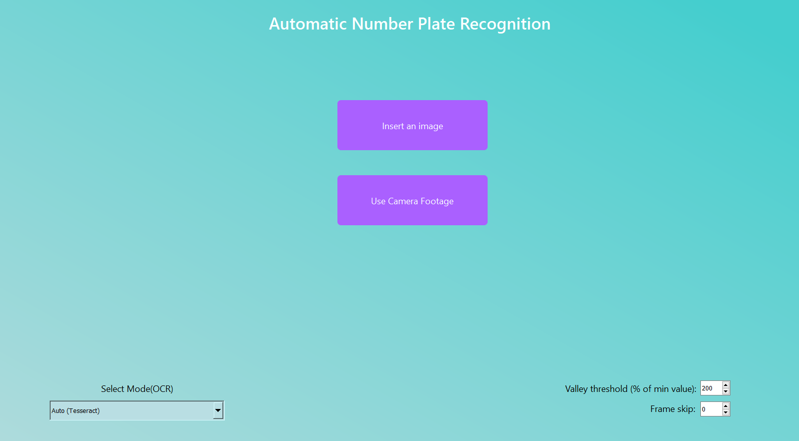
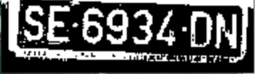
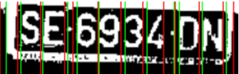
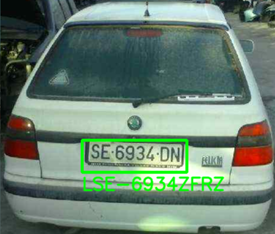
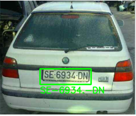

# License Plate Detection
Computer Vision Python application including a graphical interface that allows the user to extract license plates, at a character level, from images loaded from disk, or from images provided from camera/webcam footage.
The project was done in a limited hardware environment, with emphasis on implementing from scratch most of the algorithms and features.

## Pipeline and Features
1. Input image selection using the GUI;
2. Image vehicle detection (using preexistent YOLOv8), then each vehicle is cropped and treated separately:
  3. Manipulation using morphological operations, including Blackhat, erosion, dilation, Canny edge detection, binary thresholding;
  4. Selecting regions of interest based on area and aspect ratio, filtering the rectangles;
  5. Performing OCR on each region of interest:
     - Automatically, using PyTesseract;
     - Manually:
       - Split the region of interest using vertical projection, separating each individual character;
       - Perform character-level OCR using a custom CNN, manually trained using a synthetically generated character dataset.


## Visual Example






## Setup and Running
```
pip install -r requirements.txt
```
Requires [Tesseract OCR](https://github.com/tesseract-ocr/tesseract) to be installed separately.

```
python GUI.py
```
